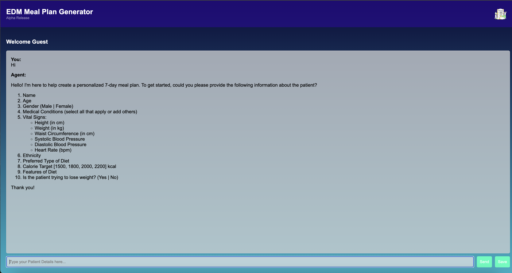

# Eddie: Personalized AI Meal Planner  
**Authored by Dr. Kanav Kahol**

Eddie is an AI-powered personalized meal planning assistant built using FastAPI and OpenAI’s GPT-4o. It creates highly customized 7-day meal plans tailored to a patient's medical conditions, ethnicity, dietary preferences, and weight management goals.

The application streams the AI's responses in real-time and allows users to save their meal plans in both Markdown and PDF formats.



---

## 🧠 Key Features

- 🥗 **AI-generated 7-day meal plans**
- 💬 **Streaming chat interaction with OpenAI**
- 📊 **Per-meal and daily macronutrient breakdowns**
- 📚 **21 fully detailed recipes (one for each meal)**
- 💾 **Export to Markdown and PDF**
- 🌍 **Culturally relevant and health-aware meal suggestions**
- 🏥 **Tailored to chronic conditions like diabetes, hypertension, etc.**

---

## 🚀 Getting Started

### Prerequisites

- Python 3.8+
- [OpenAI API key](https://platform.openai.com/account/api-keys)
- [wkhtmltopdf](https://wkhtmltopdf.org/) (for `pdfkit` to work)
- pip

### Installation

1. **Clone the repository**
   ```bash
   git clone https://github.com/your-username/eddie-meal-planner.git
   cd eddie-meal-planner
   ```

2. **Install dependencies**
   ```bash
   pip install -r requirements.txt
   ```

3. **Create a `.env` file**
   ```
   OPENAI_API_KEY=your_openai_api_key
   ```

4. **(Optional) Install wkhtmltopdf**
   - [Download here](https://wkhtmltopdf.org/downloads.html) and ensure it’s in your PATH.

---

## 🏃‍♂️ Running the Application

```bash
uvicorn main:app --reload
```

Visit: [http://localhost:8000](http://localhost:8000)

---

## 🖥️ File Structure

```
.
├── main.py                # FastAPI server with endpoints for streaming and saving meal plans
├── query_openai.py        # Query handler with prompt engineering and OpenAI integration
├── requirements.txt       # Python dependencies
├── templates/index.html   # UI template for interaction
├── static/                # Static assets (CSS, JS)
├── saved_recipes/         # Output folder for generated meal plans
└── .env                   # API key for OpenAI (not checked into version control)
```

---

## 🧩 Endpoints

- `/` – Renders the main app page.
- `/home` – Redirect view with a custom name.
- `/stream` – Streams AI response for a user query in real-time using Server-Sent Events (SSE).
- `/save_meal_plan` – Accepts JSON payload and saves the meal plan as `.md` and `.pdf`.

---

## 📝 Example Usage

Input:
```json
{
  "name": "Kanav",
  "meal_plan": "# Day 1\nBreakfast: ..."
}
```
or simply type in the 

Output:
- `saved_recipes/Kanav_2025-03-25.md`
- `saved_recipes/Kanav_2025-03-25.pdf`

---

## 🔐 Security Note

This project uses `dotenv` to securely manage API keys and other environment variables. Ensure your `.env` is never committed to source control.

---

## ✍️ Author

**Dr. Kanav Kahol**  
GenAi Expert
---

## 📄 License

This project is licensed under the MIT License.
